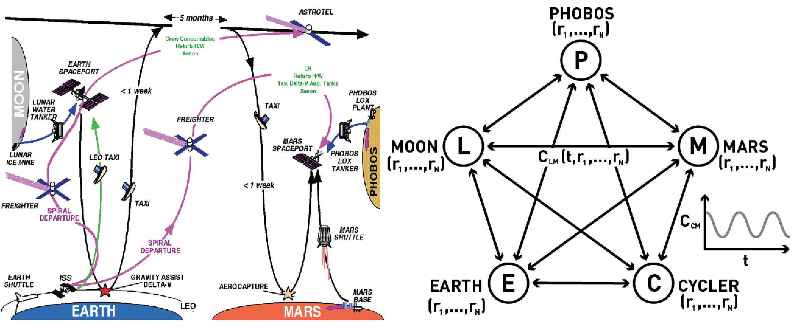

# Cycler Architecture

1. Definition
   1. A cycler is an orbital trajectory where a body encounters two planets on a regular schedule without entering into the orbit of either planet. 
      1. These trajectories can vary in the frequency with which they encounter the planets, as well as the number and magnitude of maneuvers required to maintain the orbit
      2. Cyclers that require almost no fuel to maintain are known as "ballistic cyclers"
         1. Because ballistic cyclers require little fuel, an extremely large vehicle travelling on this trajectory is effectively there permanently
   2. Our proposal is for an extremely large cycler vehicle to be incrementally constructed during the course of multiple missions from the excess mass that would normally be discarded during the course of these missions. 
      1. One critical component of this plan is an understanding of the mass flow in a cycler architecture
         1. both with and without the ability to recycle components
2. Background
   1. Recent focus on the intermediate states of a cycler architecture
      1. e.g. Establishing cycler trajectories 
   2. ​
3. Modelling Mass Flow
   1. A general framework for examining the logistics of an infrastructure
4. ​

