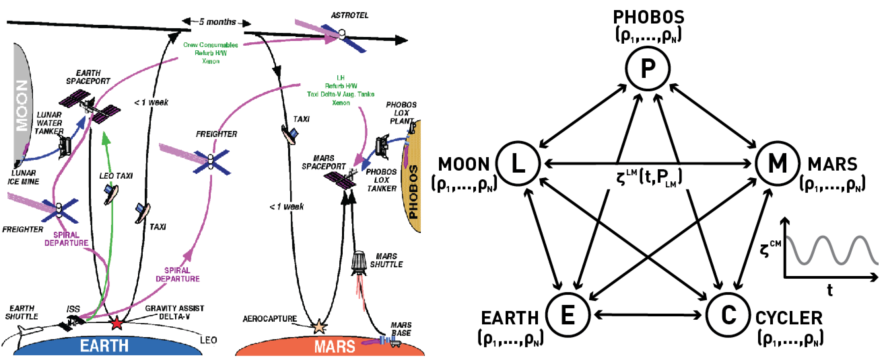

# Cycler Architecture

A cycler is an orbital trajectory where a body encounters two planets on a regular schedule without entering into the orbit of either planet. This periodic encouter without orbiting removes the need for regular maneuvers, reducing fuel costs and allowing an extremely large vehicle to efficiently travel on this trajectory. Cyclers have been studied for fifty years, with the most famous being the Aldrin Cycler between Earth and Mars. The Astrotel NIAC examined a mission where a cycler played a central role in the exploration of Mars, and included the Mission Architecture and Model Analysis (MAMA) trade study, which provided a means to chart the roadmap of technologies necessary for the Astrotel concept. 

RHISE expands on this existing work in the cycler mission in two critical ways. One, it **examines** the extensive use of reconfigurability to allow large vehicles to be incrementally constructed over the course of several missions. Two, it **formalizes** the approach taken by the MAMA study, allowing the use of the existing and extensive work in network theory and analysis to examine the optimal placement of resources to allow the efficient transfer of humans between Earth and Mars. 

## Outline

1. Definition
   1. A cycler is an orbital trajectory where a body encounters two planets on a regular schedule without entering into the orbit of either planet. 
      1. These trajectories can vary in the frequency with which they encounter the planets, as well as the number and magnitude of maneuvers required to maintain the orbit
      2. Cyclers that require almost no fuel to maintain are known as "ballistic cyclers"
         1. Because ballistic cyclers require little fuel, an extremely large vehicle can travel on the orbit without excessive operating costs.
   2. Our proposal is for an extremely large cycler vehicle to be incrementally constructed during the course of multiple missions from the excess mass that would normally be discarded during the course of these missions. 
      1. One critical component of this plan is an understanding of the mass flow in a cycler architecture.
2. Background
   1. History of Cycler orbits
      1. Originally introduced by Hollister in the mid sixties, the most famous of these trajectories is the Aldrin cycler, which are capable of ~6-month traversals between Earth and Mars in one direction, and 1.5 year traverseals in the other. 
         1. These trajectories can be configured such that the ~6-month traversal is in either the Earth to Mars (Up-) or vice-versa (Down-) direction, 
         2. Typical cycler missions propose two vehicles, one on each of these orbits, in order to ensure minimal travel time in interplanetary space.
      2. The Astrotel NIAC examined a transportation infrastructure involving cyclers for travel between Earth and Mars
         1.  included several additional support vehicles, including freighters, spaceports, and taxis around multiple other bodies, including the Moon and Phobos.
         2. The work culminated in the MAMA trade study: a full exploration of the range of dependencies which support a cycler architecture
   2. the MAMA trade study was designed to allow the identification of critical technologies that would enable the cycler infrastructure
      1. These included fuel storage, propulsion technologies, and ISRU
         1. the majority of the estimated cost of the mission was in development of these technologies
      2. The building blocks of the estimates used in the trade study were high-fidelity analyses of the engineering requirements of each capability
   3. Assumed the development and establishment of an entire infrastructure using a traditional approach
      1. Recent focus on the intermediate states of a cycler architecture
         1. e.g. Establishing cycler trajectories through V_{\inf} leveraging
3. Modelling Mass Flow
   1. Critical component of the RHISE mission is the effectiveness of reconfigurability
      1. Reconfigurability enables a new way to explore space, where the discarded mass in each mission is intelligently reused to increase the capability and reduce the cost of subsequent missions.
   2. A general framework for examining the logistics of an infrastructure, including its establishment, growth, and maintenance. 

## Prose

### Definition

A cycler is an orbital trajectory where a body encounters two planets on a regular schedule without entering into the orbit of either planet. These trajectories can vary in the frequency with which they encounter the planets, as well as the number and magnitude of maneuvers required to maintain the orbit. Cyclers that require almost no fuel to maintain are known as "ballistic cyclers", and because they require little fuel, an extremely large vehicle can travel on the orbit without excessive operating costs. 

### Background

Originally introduced by Hollister in the mid sixties, the most famous of the cycler trajectories is the Aldrin cycler, which is capable of ~6-month traversals between Earth and Mars in one direction, and ~1.5 year traverseals in the other. These trajectories can be configured such that the ~6-month traversal is in either the Earth to Mars (Up-) or vice-versa (Down-) direction, and so typical cycler missions propose two vehicles, one on each of these orbits, in order to ensure minimal travel time in interplanetary space.

The Astrotel NIAC examined a transportation infrastructure involving cycler vehicles for travel between Earth and Mars. This architecture included several additional support vehicles, including freighters, spaceports, and taxis around multiple other bodies, including the Moon and Phobos. The work culminated in the Mission Architecture and Model Analysis (MAMA) trade study: a full exploration of the range of dependencies which support a such a mission architecture.

The MAMA trade study was designed to allow the identification of critical technologies that would help realize the cycler mission. These technologies included cryogenic fuel storage, solar electric and nuclear propulsion, and ISRU. As a result, the majority of the estimated cost of the mission was in the development of these technologies, with the building blocks of these estimates being high-fidelity analyses of the engineering requirements of each desired capability. 

### RHISE

An important aspect of the MAMA trade study was the adoption of a relatively traditional approach for the construction of this interplanetary infrastructure, which resulted in the focus on a smaller cycler vehicle that transported a modest crew. 

_**Figure 1:** A comparison between previous and proposed methods for logistics optimization in a cycler architecture. The left figure is from the Phase 2 report by Nock et. al. and the right figure is an abstraction of the method using network theory. Each node in the network represents a destination, with different amounts of various resources (r1, r2,…, rN) and connections with cost functions C that depend on the time t and the resources being sent._

